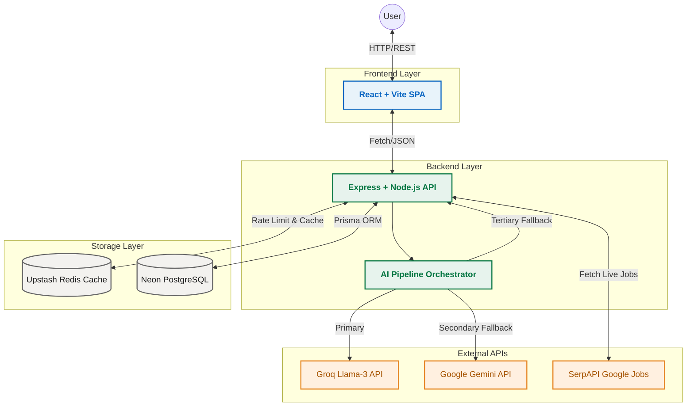

# Architecture Reference

## Overview

Signal Board relies on a robust, distributed architecture designed for **antifragility**. When external services (like Redis or LLMs) become unavailable, the system transparently degrades to local heuristics and caching to ensure zero downtime.

## Mermaid Architecture Diagram



## AI Search Pipeline

The AI Pipeline uses a "Fail-Open" cascade:
1. **Primary**: Groq (Llama-3). Extremely fast, low latency parsing.
2. **Secondary**: Google Gemini. Used if Groq hits rate limits or goes offline.
3. **Tertiary (Zero-API)**: Local heuristic regex parser. Ensures the core product never breaks even if the entire internet goes down.

## Folder Structure

```text
signal-board/
├── client/                 # React SPA (Vite + Tailwind v4)
│   ├── src/
│   │   ├── components/     # UI Components (Employer, Candidate, Common)
│   │   ├── services/       # API integration layer
│   │   └── App.jsx         # Root component with ErrorBoundary
│   └── package.json
├── server/                 # Express API (Node.js)
│   ├── src/
│   │   ├── controllers/    # Business logic (Jobs, Search, Auth, AI)
│   │   ├── middleware/     # Rate Limiting, Error Handling, Auth Verification
│   │   ├── routes/         # Express Routing
│   │   ├── services/       # Database, Cache, and AI Pipeline Orchestrators
│   │   └── index.js        # Server Entrypoint
│   ├── prisma/             # Database Schema
│   └── package.json
├── .github/workflows/      # CI/CD Pipelines
├── vercel.json             # Vercel Deployment Config
└── package.json            # Root configuration (if applicable)
```
